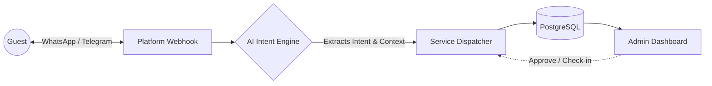

# AI Hotel Concierge & SaaS Dashboard 🏨✨

A production-ready SaaS platform that manages **multiple hotels**, automates guest bookings via **WhatsApp & Telegram**, and provides a powerful **real-time Dashboard** for hotel administrators. Powered by OpenAI's GPT-4.

## 🌟 Key Features

- **Automated AI Reservations:** Guests can browse rooms, check availability, and book stays natively through WhatsApp and Telegram.
- **Smart Support & Complaints:** Real-time routing of guest issues to staff, with automatic AI apologies when issues are resolved.
- **Multi-Tenant SaaS:** Manage multiple hotels from a single instance, each with its own WhatsApp/Telegram bots and settings.
- **Real-Time Admin Dashboard:** A sleek, dark-themed responsive dashboard to manage rooms, approve reservations, track expenses, and view financial reports.
- **Background Automation:** Automatic "Check-in" welcome messages and post-stay "Rate Your Stay" follow-ups.

## 🏗 Architecture



## 🛠 Tech Stack

- **Backend:** FastAPI (Python), SQLAlchemy 2.0 (Async)
- **Database:** PostgreSQL (with Alembic for migrations)
- **AI Engine:** OpenAI GPT-4
- **Messaging:** Meta WhatsApp Cloud API & Telegram Bot API
- **Frontend:** Vanilla JS, HTML, CSS (Single Page App)

## 🚀 Quick Start

1. **Environment Setup**
   ```bash
   cp .env.example .env
   # Edit .env with your OpenAI API Key and Database URL
   ```

2. **Run Migrations**
   ```bash
   alembic upgrade head
   ```

3. **Start the Server**
   ```bash
   uvicorn app.main:app --reload
   ```

4. **Access the Dashboard**
   Open your browser and navigate to: `http://localhost:8000/dashboard/`

## 🔗 Webhook Configuration

To connect the AI bot to the messaging platforms, use these endpoints:

- **WhatsApp (Meta):** `https://your-domain.com/webhook`
- **Telegram (BotFather):** `https://your-domain.com/telegram-webhook`

*(Note: For local testing, use a tunneling service like **ngrok** to expose your server).*

## 📖 License

Private — All rights reserved.
